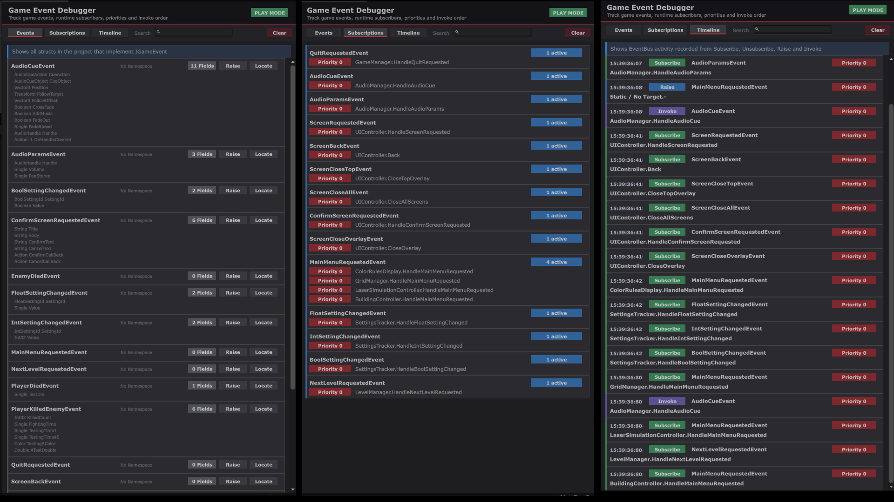

# Event Bus

Event Bus is a lightweight static event bus package for Unity.

It lets you define events as structs, subscribe handlers to those events, raise events globally, and inspect event activity through an editor debugger window.



## Features

- Static event bus API
- Event structs through `IGameEvent`
- Priority based subscriptions
- Simple subscribe, unsubscribe and raise methods
- Runtime debug recording
- Event list, subscription list, and timeline views
- Script locator for finding event definitions
- Basic Usage sample scene

## Installation

### Install from Git URL

In Unity:

1. Open **Window > Package Manager**
2. Press **+**
3. Select **Install package from git URL**
4. Enter:

```txt
https://github.com/ClearKitten/com.karlbanan.eventbus.git
```

## Requirements

- Unity 6000.0 or newer

## Basic Usage

Create an event by defining a struct that implements `IGameEvent`

```csharp
using KarlBanan.EventBus

public readonly struct PlayerDamagedEvent : IGameEvent
{
    public readonly int Damage;
    public readonly string Source;

    public PlayerDamagedEvent(int damage, string source)
    {
        Damage = damage;
        Source = source;
    }
}
```

Subscribe to the event

```csharp
using KarlBanan.EventBus;
using UnityEngine;

public sealed class DamageListener : MonoBehaviour
{
    private void OnEnable()
    {
        EventBus.Subscribe<PlayerDamagedEvent>(OnPlayerDamaged, EventPriority.NORMAL);
    }

    private void OnDisable()
    {
        EventBus.Unsubscribe<PlayerDamagedEvent>(OnPlayerDamaged);
    }

    private void OnPlayerDamaged(PlayerDamagedEvent gameEvent)
    {
        Debug.Log($&quot;Player took {gameEvent.Damage} damage from {gameEvent.Source}.&quot;);
    }
}
```

Raise the event:

```csharp
using KarlBanan.EventBus;
using UnityEngine;

public sealed class DamagePublisher : MonoBehaviour
{
    public void DamagePlayer()
    {
        EventBus.Raise(new PlayerDamagedEvent(10, &quot;Sample Publisher&quot;));
    }
}
```

## Priorites 

Handlers with higher priority values are invoked first.


```csharp
EventBus.Subscribe<PlayerDamagedEvent>(OnPlayerDamagedEarly, EventPriority.HIGH);
EventBus.Subscribe<PlayerDamagedEvent>(OnPlayerDamagedNormal, EventPriority.NORMAL);
EventBus.Subscribe<PlayerDamagedEvent>(OnPlayerDamagedLate, EventPriority.LOW);
```

Built-in priority constants

```csharp
EventPriority.ULTRA_HIGH
EventPriority.VERY_HIGH
EventPriority.HIGH
EventPriority.NORMAL
EventPriority.LOW
EventPriority.VERY_LOW
EventPriority.ULTRA_LOW
```

## Debugger Window

Open the debugger from Unity:

```txt
Tools > KarlBanan > Game Event Debugger
```

The debugger includes:

- **Events**: shows discovered event structs that implement `IGameEvent` 
- **Subscriptions**: shows active event subscriptions during play mode
- **Timeline**: shows recorded subscribe, unsubscribe, raise, and invoke activity

## Samples

This package includes a **Basic Usage** sample.

To import it:

1. Open **Window > Package Manager**
2. Select **Event Bus**
3. Open **Samples**
4. Import **Basic Usage**
5. Open the included sample scene

The README only shows a small useage example. Import the sample for a complete scene-based example.

## Licence

MIT License. See [LICENSE.md](LICENSE.md).